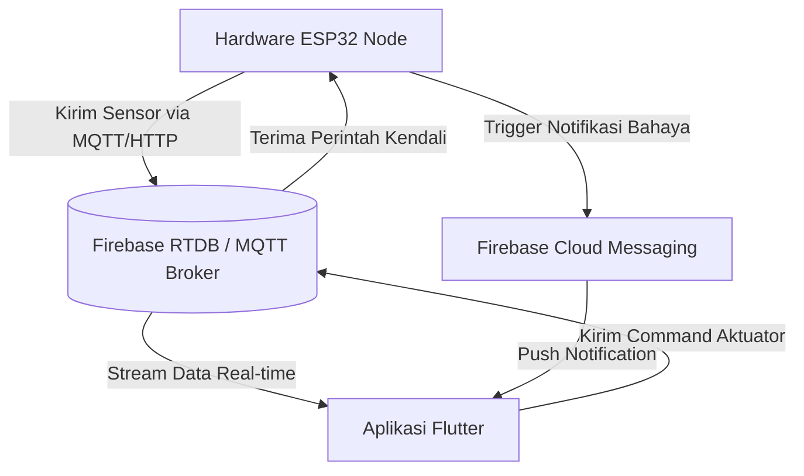

# Product Requirement Document (PRD) - Panel Care

## 1. Pendahuluan & Latar Belakang
Panel Care (Sistem Pendinginan dan Pembersihan Panel Surya Berbasis Internet of Things) adalah aplikasi mobile berbasis Flutter yang dirancang untuk memantau kinerja parameter elektrikal serta mengendalikan sistem pendingin dan pembersih panel surya secara otomatis maupun manual.

Efisiensi panel surya dapat menurun secara signifikan akibat suhu permukaan yang terlalu tinggi (overheating) atau akumulasi debu/kotoran. Aplikasi Panel Care terhubung ke mikrokontroler ESP32 melalui koneksi Wi-Fi local/cloud untuk memberikan visualisasi real-time parameter sensor serta kendali penuh atas aktuator fisik.

---

## 2. Tujuan & Pengguna Target
*   **Tujuan**: Menyediakan antarmuka premium, responsif, dan mudah digunakan untuk memantau status kesehatan panel surya, mengontrol suhu (Peltier/Fan), serta mengaktifkan wiper pembersih debu.
*   **Pengguna Target**: Operator pemeliharaan panel surya, pemilik instalasi panel surya mandiri, serta akademisi/peneliti sistem IoT energi terbarukan.
*   **Pengembang Sistem**: Hayatun Nufus (Politeknik Perkapalan Negeri Surabaya, 2026).

---

## 3. Struktur Direktori Proyek
Proyek ini mengadopsi struktur berbasis fitur (Feature-First Architecture) untuk memastikan modularitas dan kemudahan pemeliharaan:

```text
lib/
├── core/
│   ├── constants/
│   │   ├── app_assets.dart      # Manajemen aset gambar/ilustrasi
│   │   ├── app_colors.dart      # Sistem warna terpusat (Material 3, Premium Pink)
│   │   ├── app_radius.dart      # Token border radius
│   │   ├── app_shadows.dart     # Token bayangan (depth & elevation)
│   │   └── app_spacing.dart     # Token jarak/padding/margin
│   ├── theme/
│   │   └── app_theme.dart       # Konfigurasi ThemeData global (Google Fonts Poppins)
│   └── widgets/
│       ├── app_card.dart        # Kartu dasar berdesain glassmorphism-lite
│       ├── app_metric_card.dart # Widget penampil metrik sensor
│       ├── app_section_title.dart# Judul section seragam
│       ├── app_status_chip.dart # Badge status (ON/OFF, Online/Offline, Optimal)
│       ├── app_switch_tile.dart # Kontrol toggle switch kustom
│       ├── custom_button.dart   # Tombol utama/sekunder bertema pink
│       └── custom_textfield.dart# Input field teks dengan validasi/desain terstandar
│
├── features/
│   ├── auth/                    # Modul otentikasi pengguna
│   │   └── presentation/
│   │       ├── screens/
│   │       │   ├── login_screen.dart
│   │       │   └── splash_screen.dart
│   │       └── widgets/
│   │           └── solar_illustration.dart
│   ├── dashboard/               # Beranda utama & ringkasan perangkat
│   │   └── presentation/
│   │       └── screens/
│   │           └── dashboard_screen.dart
│   ├── monitoring/              # Analitik grafik parameter sensor
│   │   └── presentation/
│   │       └── screens/
│   │           └── monitoring_screen.dart # Grafik custom painter real-time
│   ├── cooling/                 # Kontrol aktuator pendingin
│   │   └── presentation/
│   │       └── screens/
│   │           └── cooling_screen.dart
│   ├── control/                 # Kontrol aktuator pembersih & jadwal RTC
│   │   └── presentation/
│   │       └── screens/
│   │           └── controller_screen.dart
│   ├── settings/                # Konfigurasi Wi-Fi & info sistem
│   │   └── presentation/
│   │       └── screens/
│   │           └── settings_screen.dart
│   └── history/                 # Log riwayat kejadian & push notification
│       └── presentation/
│           ├── screens/
│           │   ├── history_screen.dart
│           │   └── notification_page.dart
│           └── widgets/
│               └── history_item_card.dart
│
├── navigation/
│   └── main_navigation.dart     # Pengatur tab bar navigasi bawah (Bottom Navigation)
└── main.dart                    # Entry point aplikasi & inisialisasi Firebase/FCM
```

---

## 4. Spesifikasi Fungsional Fitur

### 4.1. Modul Otentikasi (Auth)
*   **Splash Screen**: Menampilkan logo Panel Care dengan animasi transisi ke halaman login.
*   **Login Screen**: 
    *   Input email dan password dengan validasi visual.
    *   Fitur "Remember me" dan tombol reset "Forgot password?".
    *   Opsi masuk menggunakan Biometrik (Sidik Jari/Wajah).
    *   Transisi halus (*seamless transition*) dengan latar belakang ilustrasi yang memudar (*fade-in*).

### 4.2. Dashboard Utama
*   **Sistem Status**: Indikator koneksi ESP32 (Online/Offline) dan stempel waktu terakhir data diperbarui.
*   **Grid Metrik Sensor**:
    1.  *Suhu Panel* (°C) - Batas optimal normal.
    2.  *Suhu Air* (°C) - Suhu air pendingin tangki.
    3.  *Kadar Debu* (μg/m³) - Indikasi tingkat kebersihan permukaan panel.
    4.  *Tegangan Listrik* (V) - Output tegangan panel surya.
    5.  *Arus Listrik* (A) - Output arus panel surya.
    6.  *Daya Listrik* (W) - Output daya aktif (V × A).
*   **Status Aktuator**: Ringkasan status ON/OFF dari Peltier, Fan, Pompa Pendingin, dan Pompa Pembersih.

### 4.3. Modul Monitoring & Analitik
*   **Visualisasi Data**: Grafik garis (*line chart*) kustom yang di-render langsung menggunakan *CustomPainter* Flutter untuk performa tinggi tanpa lag.
*   **Filter Waktu**: Filter data berdasarkan periode waktu:
    *   *Real-time* (data sensor terkini)
    *   *1 Hari*
    *   *7 Hari*
    *   *30 Hari*

### 4.4. Modul Pendinginan (Cooling Screen)
*   **Pembacaan Suhu**: Kartu perbandingan ganda untuk Suhu Panel dan Suhu Air.
*   **Kontrol Aktuator**:
    *   *Peltier Toggle*: Mengaktifkan elemen thermoelectric cooler untuk mendinginkan air tangki.
    *   *Fan Toggle*: Mengaktifkan kipas pembuangan panas radiator.
*   **Status Pompa Pendingin**: Menampilkan indikator kecepatan pompa air (*PWM %*) saat bersirkulasi mendinginkan panel.

### 4.5. Modul Pembersihan (Cleaning Screen / Controller)
*   **Pemilihan Mode**:
    *   *Manual*: Pengguna secara instan memulai (*Start*) atau menghentikan (*Stop*) proses pencucian panel.
    *   *Auto (Terjadwal RTC)*: Wiper dan pompa menyala otomatis berdasarkan jadwal jam dari Real-Time Clock (RTC) ESP32.
*   **Kontrol Aktuator Manual**: Toggle kontrol mandiri untuk Wiper (Motor Power Window) dan Pompa Pembersih (Water Pump).
*   **Penjadwalan RTC**: Pengaturan jam pembersihan otomatis (secara default diatur pada jam **07:00** dan **18:00**).

### 4.6. Modul Pengaturan (Settings Screen)
*   **Koneksi Wi-Fi**: Menampilkan nama SSID Wi-Fi lokal yang digunakan oleh ESP32 (contoh: `SOLARCARE_24GHz`).
*   **Device Management**: Status konektivitas perangkat keras ESP32.
*   **Setpoint Suhu**: Pengaturan batas suhu panel (°C) untuk mentrigger pendinginan otomatis. Nilai setpoint default adalah **42°C** (dapat diubah melalui dialog input angka).
*   **Informasi Sistem**: Versi firmware ESP32, versi aplikasi, serta lembar *About* (Politeknik Perkapalan Negeri Surabaya, 2026).

### 4.7. Modul Notifikasi & Riwayat (History & Notification Page)
*   **Notification Timeline**: Daftar kronologis dari aktivitas dan peringatan sistem, seperti:
    *   ESP32 berhasil terhubung/terputus.
    *   Peltier aktif/mati.
    *   Proses pembersihan manual dimulai/selesai.
    *   Peringatan suhu panel melebihi batas setpoint (*High Temperature Warning*).
*   **Firebase Cloud Messaging (FCM)**: Push notification yang dikirim ke perangkat Android pengguna saat terjadi kondisi kritis (misal: suhu kritis).

---

## 5. Panduan Desain & Estetika (UI/UX)
Aplikasi ini menerapkan identitas visual **Premium Pink Theme** yang unik dan kokoh untuk menghindari kesan monoton aplikasi industri/IoT pada umumnya.

### 5.1. Token Warna Utama ([app_colors.dart](file:///c:/Users/abhip/panel_surya/lib/core/constants/app_colors.dart))
*   `primary`: `#E91E63` (Pink 600) — Aksen utama untuk penanda status aktif, tombol primer, dan navigasi terpilih.
*   `background`: `#FFF8FB` — Latar belakang lembut kemerahan untuk mengurangi kelelahan mata.
*   `surface`: `#FFFFFF` — Latar kartu dan panel navigasi dengan bayangan halus.
*   **Warna Kode Sensor**:
    *   Suhu Panel: `#FFFF6B35` (Oranye)
    *   Suhu Air: `#FF29B6F6` (Biru Muda)
    *   Debu: `#FFBCAAA4` (Cokelat Abu)
    *   Tegangan: `#FFFFCA28` (Kuning)
    *   Arus: `#FF66BB6A` (Hijau)
    *   Daya: `#FFAB47BC` (Ungu)

### 5.2. Tipografi
*   Menggunakan Google Fonts **Poppins** secara global untuk memberikan kesan modern, bersih, dan profesional.
*   Custom Font **Grunge** (`assets/fonts/Grunge.ttf`) dikonfigurasi untuk gaya judul dekoratif opsional.

### 5.3. Interaksi & Transisi
*   Navigasi bawah (*Bottom Navigation Bar*) didesain melayang (*floating*) dengan sudut melingkar ekstrem (*pill radius*) dan animasi pembesar ikon yang halus saat terpilih.
*   Perpindahan halaman menggunakan transisi memudar (*FadeTransition*) berdurasi 280-500ms agar terasa premium dan responsif.

---

## 6. Arsitektur Komunikasi IoT (ESP32 Integration)
Aplikasi saat ini menggunakan data tiruan (*mock data*) terstruktur. Untuk menghubungkan aplikasi ini ke perangkat keras fisik ESP32 secara real-time, AI Agent atau Pengembang harus menerapkan skenario berikut:



### 6.1. Alur Transmisi Data
1.  **Telemetry Data (Sensor)**: ESP32 membaca sensor analog (Suhu, Tegangan, Arus, Debu) lalu mengirimkannya sebagai payload JSON. Aplikasi Flutter mendengarkan perubahan nilai ini secara berkala.
2.  **Actuator Controls**: Ketika toggle (Peltier, Fan, Wiper, Pompa) ditekan di aplikasi, aplikasi menulis perintah biner (`0` atau `1`) atau nilai PWM (`0`-`255`) ke path database yang dipantau oleh ESP32.
3.  **RTC Sync**: Pengaturan jadwal di aplikasi diperbarui ke memori EEPROM/RTC ESP32 agar ESP32 tetap dapat berjalan otomatis secara offline tanpa ketergantungan konstan pada aplikasi.

---

## 7. Rekomendasi Kerja Untuk AI Agent (Future Development Tasks)
Jika Anda adalah AI Agent yang ditugaskan untuk memodifikasi atau mengembangkan aplikasi ini lebih lanjut, ikuti panduan berikut:

1.  **State Management**: Integrasikan state management seperti **BLoC** atau **Riverpod** untuk memisahkan logika IoT dari UI widget. Mulailah dengan membuat folder `application` atau `bloc` di masing-masing modul fitur.
2.  **Koneksi Real-time**: Gantikan variabel lokal di `_CoolingScreenState` atau `_ControllerScreenState` dengan stream Firebase Database (`firebase_database`) atau klien MQTT (`mqtt_client`).
3.  **Local Authentication**: Untuk otentikasi biometrik pada `login_screen.dart`, tambahkan paket `local_auth` dan implementasikan di dalam fungsi `_handleLogin`.
4.  **Optimasi Grafik**: Jika rentang titik data sensor pada halaman `monitoring_screen.dart` menjadi sangat besar, pastikan untuk menggunakan optimasi data downsampling sebelum menggambar grafik dengan `_MiniChartPainter`.
5.  **Preservasi Kode**: Selalu pertahankan desain visual premium pink, token jarak (`AppSpacing`), dan radius kelengkungan (`AppRadius`) untuk menjaga keselarasan estetika.
